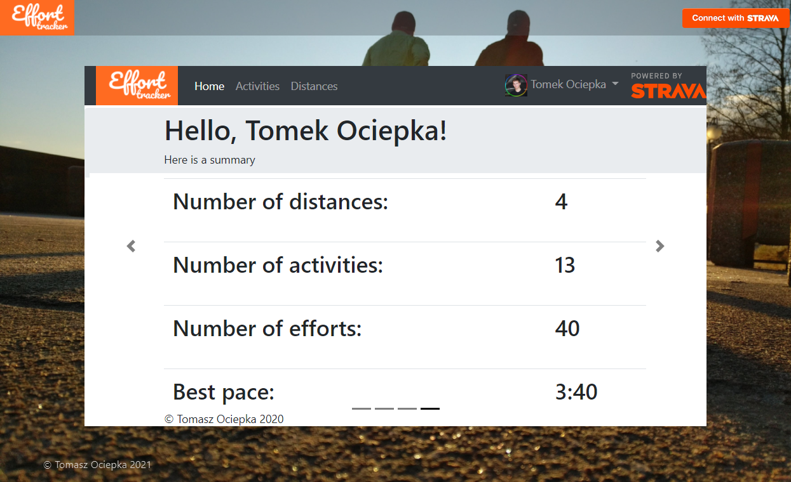
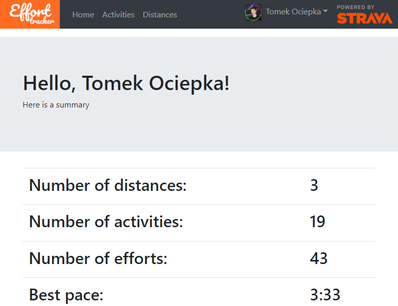
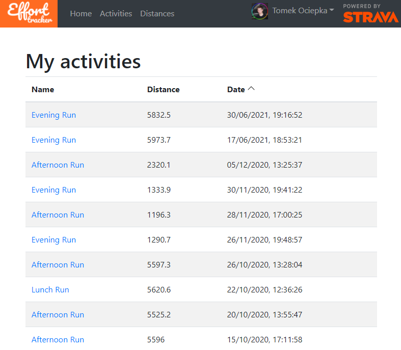
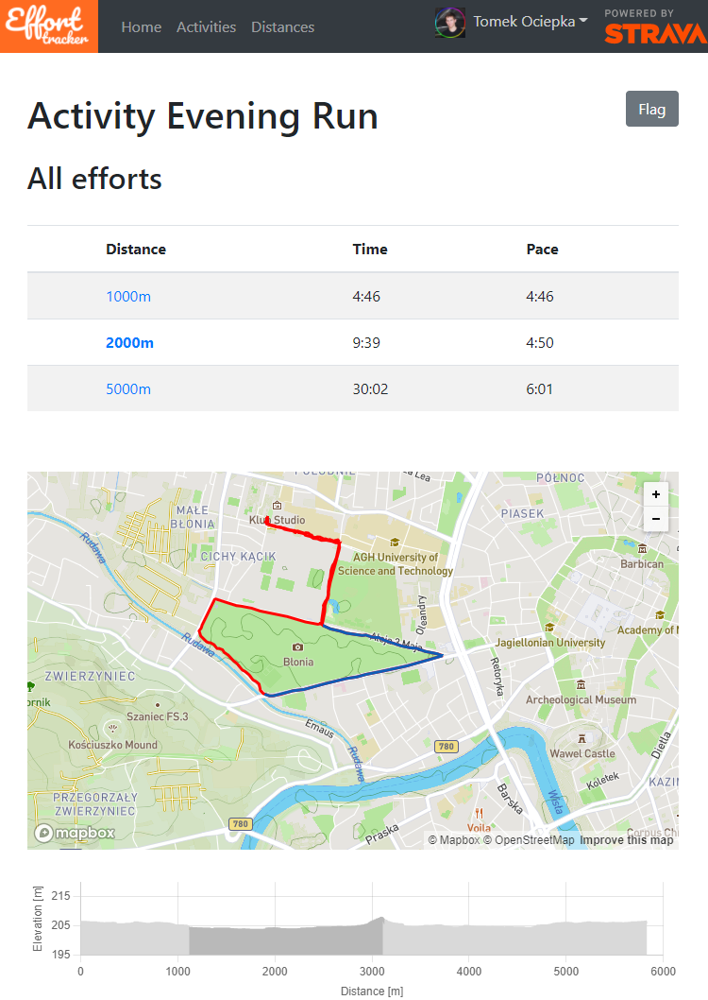
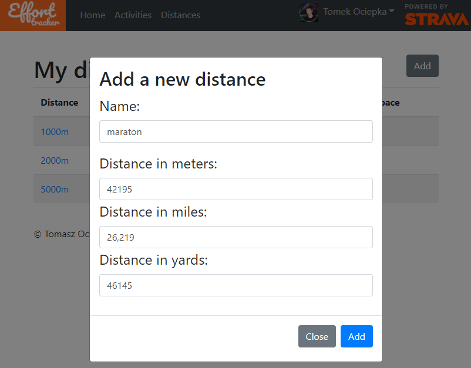
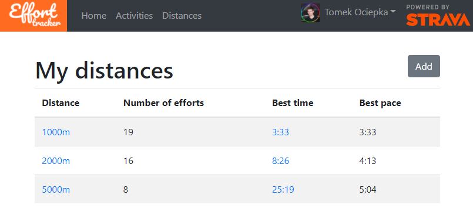
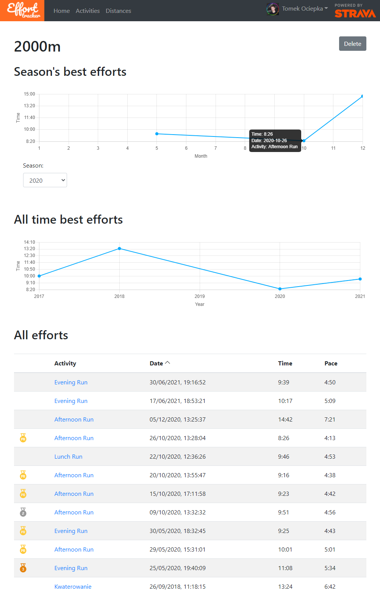

# Effort tracker

Effort tracker is a tool that keeps track of your running performance, based on Strava API.

## Features
 - creation of distances of any length
 - visualization of running performance progress on given distance over the years
 - visualization of running performance progress on given distance throughout the season
 - measurement of time on each distance, on each activity
 - achievement system
 - automatic addition of achievements to strava activity

## Requirements
 - Node.js v14.16.1 >=
 - Npm 6.14.1 >= 
 - PostgreSQL 8.2 >=
 - JRE 15 >=
## Setup

### Frontend
 1. create `.env` file and set `REACT_APP_MAPBOX_API_KEY` variable to your Mapbox API token
 2. run `npm install`
 3. run `npm start`

### Backend
 1. configure database connection in `application.yml` file
 2. run Spring application with following enviroment variables:
    * PORT=8080
    * CLIENT-ID= (Strava client ID)
    * CLIENT-SECRET= (Strava client secret)
    * WEBHOOK_SUBSCRIPTION_ID= (ID of Strava webhook subscription)
    
## Screenshots

 
 